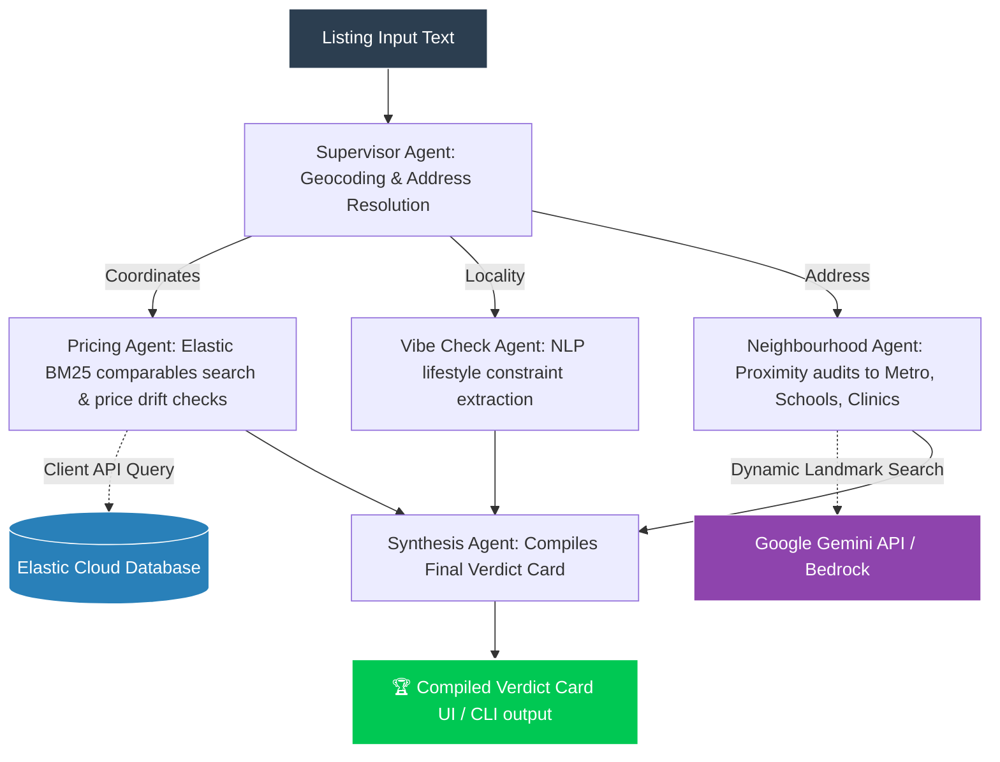

# ⚖️ Rental Truth-Teller: Bangalore Multi-Agent Verification System

Rental Truth-Teller is a state-of-the-art, multi-agent verification network built using **LangGraph**, **Elasticsearch (ELSER + BM25)**, and **Google Gemini / AWS Bedrock** LLMs. 

The system automatically parses real estate/rental listing advertisements in Bangalore, resolves spatial coordinates, dynamically queries Elasticsearch databases or LLM benchmark generators to calculate localized pricing drifts, audits local points of interest (Transit Metro, Schools, Hospitals, and Markets), and compiles a high-fidelity **Verdict Card** complete with upfront move-in cost projections and a custom smart broker questionnaire.

---

## 🛡️ Multi-Agent & Database Architecture

The agent network employs a fan-out/fan-in LangGraph workflow to execute parallel spatial, financial, vibe, and proximity audits.



### Agent Responsibilities:
*   **Supervisor Agent**: Resolves coordinates and addresses using dynamic geocoding chains.
*   **Pricing Agent**: Connects directly to **Elasticsearch** to query live comparables, computing locality averages and standard deviations. If database matches are sparse, it queries the LLM dynamically to estimate typical price-per-sqft benchmarks, completely eliminating hardcoded maps.
*   **Neighbourhood Agent**: Dynamically queries Gemini to search for real nearby landmarks (Transit Metro, Schools, Hospitals, and Supermarkets) around the coordinates and calculates realistic road distance buffers.
*   **Vibe Check Agent**: Highlights descriptive discrepancies (e.g., claims vs. reality) and parses marital, diet (pure-veg), and pet constraints.
*   **Synthesis Agent**: Fuses all sub-agent metrics into a single client-ready Verdict Card featuring smart broker checklists and move-in cost sheets.

---

## 🚀 Getting Started

### 1. Environment Setup
Clone the repository, create and activate a Python virtual environment, and install the dependencies:
```bash
# Create and activate virtualenv
python3 -m venv .venv
source .venv/bin/activate  # On Windows use: .venv\Scripts\activate

# Install dependencies
pip install streamlit langchain-google-genai elasticsearch pydantic pydeck
```

### 2. Configure Environment Variables (`.env`)
Create a `.env` file in the root directory. Fill in your Elasticsearch cluster endpoints and LLM credentials:
```ini
# Elasticsearch Cloud Credentials
ES_HOST=your-elastic-cloud-endpoint.cloud.elastic.cloud
ES_PORT=443
ES_SCHEME=https
ES_API_KEY=your_base64_encoded_api_key

# LLM Provider Settings (Options: gemini | bedrock | mock)
LLM_PROVIDER=gemini
GEMINI_API_KEY=your_gemini_api_key
GEMINI_MODEL=gemini-flash-latest

# AWS Bedrock Settings (if LLM_PROVIDER=bedrock)
AWS_ACCESS_KEY_ID=your_aws_key
AWS_SECRET_ACCESS_KEY=your_aws_secret
AWS_DEFAULT_REGION=us-east-1
```

---

## 🎨 Usage & Execution Options

Rental Truth-Teller provides two dedicated rendering layers for interacting with the verification network:

### Option A: Streamlit Web UI Dashboard (Premium UI)
Launch the high-fidelity Streamlit dashboard to interact with the verification network visually:
```bash
streamlit run rendering/ui/app.py
```
#### Features:
*   **Test Scenario Pre-loader**: Click to load high-fidelity listing test scenarios (Whitefield Gated Community, Koramangala Overpriced Bachelors flat).
*   **Step-by-Step Node Visualizer**: Track active sub-agent trace execution states with real-time progress markers.
*   **Unified Metrics Panel**: Displays color-coded pricing drifts, upfront cost sheets, and access scores.
*   **Interactive Geocoded Pydeck Map**: Centered directly on the property, pinning all nearby transit lines, clinics, and schools returned by the spatial agent.

---

### Option B: Interactive Terminal CLI (REPL)
Launch the CLI interface to test listings directly in your terminal:
```bash
python rendering/cli/run_truth_teller.py
```
#### CLI Flags:
*   **Interactive REPL Loop (Default)**: Paste any rental listing and press **[ENTER] twice** to verify. Type `exit` to close.
*   **Analyze Custom listing string**:
    ```bash
    python rendering/cli/run_truth_teller.py --listing "2BHK in Indiranagar, rent 50000, deposit 3L, near metro"
    ```
*   **Verify Listing inside File**:
    ```bash
    python rendering/cli/run_truth_teller.py --file path/to/listing.txt
    ```
*   **Verbose Mode (`--verbose` or `-v`)**: Displays live LLM prompts, Elasticsearch search queries, and active sub-agent routing traces.

---

## 📊 Logs & Diagnostics
Our resilient orchestration layer records every raw LLM API request and its actual JSON response. All network logs are archived separately to keep your diagnostic traces decoupled:

*   **CLI Interaction Logs**: Pushed dynamically to `cli.log` in your workspace root.
    ```bash
    # View live CLI trace logs and LLM queries
    cat cli.log
    ```
*   **Web UI Interaction Logs**: Pushed dynamically to `ui.log` in your workspace root.
    ```bash
    # View live UI trace logs, maps, and geocoding resolutions
    cat ui.log
    ```
