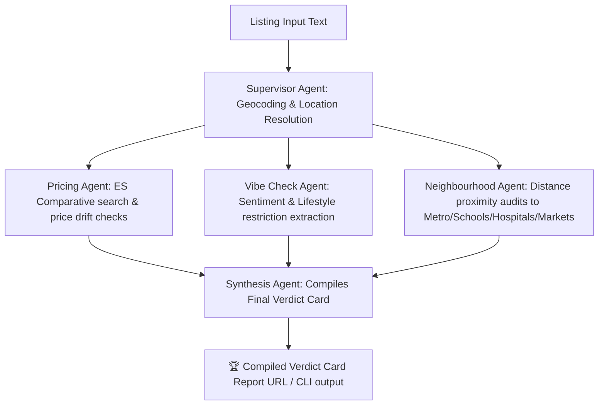

# ⚖️ Rental Truth-Teller: Bangalore Multi-Agent Verification System

A state-of-the-art multi-agent verification network built using **LangGraph**, **Elasticsearch (BM25)**, and **AWS Bedrock Claude**. Rental Truth-Teller automatically cross-references, geocodes, and assesses real estate/rental listings in Bangalore to generate high-fidelity **Verdict Cards**, identifying exaggerations, price drifts, metric irregularities, and POI proximity gaps.

---

## 🚀 Getting Started & CLI Interaction

Follow these steps to run and test the multi-agent pipeline locally.

### 1. Environment Setup
Create and activate the virtual environment, then install the required dependencies:
```bash
# Create and activate virtualenv
python3 -m venv .venv
source .venv/bin/bin/activate  # On Windows use: .venv\Scripts\activate

# Install packages
pip install -r requirements.txt
```

### 2. Running Local Scenarios
Test the compiled multi-agent graph against sample listing inputs (such as Whitefield gated communities or overpriced Koramangala properties):
```bash
# Run the verification CLI entrypoint
python scripts/run_truth_teller.py
```
> [!NOTE]
> The system automatically detects if active AWS keys or credentials are not present/dummy and triggers fallback to the high-fidelity `MockChatModel` and BM25 spatial geocoding caches, allowing seamless local integration testing out of the box!

---

## 📊 Monitoring Backend & Model Logs

Our workflow uses dual-channel logging. All active agents, tool calls, ML rerankers, and database queries are displayed in real-time on standard console output, and archived persistently.

Inspect the dedicated, complete execution trace log file in your workspace root:
```bash
# Read the full backend trace log
cat backend.log
```

### Key Invocations Logged:
1. **Agent Invocations**: Tracks active transitions between nodes (`Supervisor Agent` ➡️ `Pricing / Vibe / Neighbourhood Agents` ➡️ `Synthesis Agent`).
2. **LLM Queries**: Captures the complete system prompts, contextual metadata inputs, and structured JSON schemas queried from Bedrock (or fallback mock models).
3. **Elasticsearch Inquiries**: Logs live fuzzy matches, status codes (e.g., `POST /bangalore_properties/_search`), and credential exceptions against Elastic Cloud.
4. **Unified Synthesis**: Archives Jina Rerank/fallback reranker outputs and scoring algorithms.

---

## 🛡️ Multi-Agent Architecture



Each agent specializes in targeted validations:
*   **Supervisor Agent**: Performs spatial resolving and geo-coordinate mapping.
*   **Neighbourhood Agent**: Audits exact proximity to crucial points of interest (POI) such as Metro stations, clinics, parks, and grocery stores.
*   **Pricing Agent**: Calculates price-per-sqft and queries local Elasticsearch indexes or fallback benchmark configurations to flag pricing drift.
*   **Vibe Check Agent**: Extracts restrictive conditions (e.g. "Pure-veg preferred", "No bachelor boys") and discrepancies between promises vs. details.
*   **Synthesis Agent**: Fuses sub-agent outputs into a structured, client-ready **Verdict Card** featuring a fair area price range assessment, upfront entry cost calculation, and a **Smart Broker Questionnaire** tailored to the property's weaknesses.
